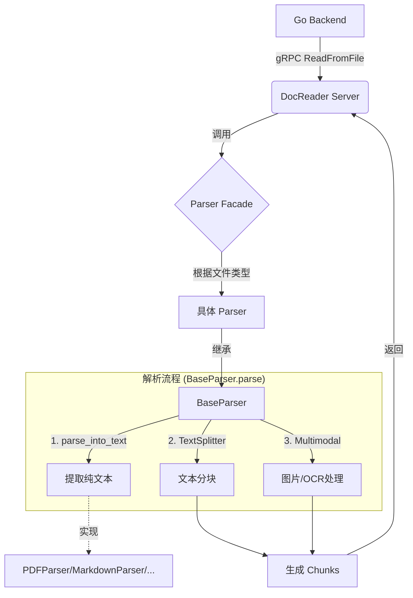

# 后端文档解析处理流程 (DocReader)

本文档详细描述了 `docreader` 服务处理文档解析的完整流程。该服务作为 gRPC Server 运行，主要负责接收 Go 后端的文件读取请求，进行文本提取、分块（Chunking）以及多模态（图片/OCR）处理。

## 1. 总体架构

DocReader 采用了 **Facade（外观）模式** 和 **Template Method（模板方法）模式** 来组织解析逻辑。

## 2. 详细处理流程

### 2.1 服务入口 (gRPC Layer)

*   **文件**: [docreader/main.py](file:///Users/young/Documents/codehub/WeiWo/WeKnora/docreader/main.py)
*   **类**: `DocReaderServicer`
*   **方法**: `ReadFromFile`

当 Go 后端发起请求时，`ReadFromFile` 方法首先被触发。它的主要职责是：
1.  接收 gRPC 请求参数（文件内容、配置等）。
2.  将 gRPC 的配置对象转换为内部使用的 `ChunkingConfig`。
3.  调用 `Parser` 类的 `parse_file` 方法。
4.  将解析结果（`Document` 对象）转换为 gRPC 响应格式 (`ReadResponse`) 并返回。

### 2.2 解析器分发 (Parser Facade)

*   **文件**: [docreader/parser/parser.py](file:///Users/young/Documents/codehub/WeiWo/WeKnora/docreader/parser/parser.py)
*   **类**: `Parser`
*   **方法**: `parse_file`

`Parser` 类充当外观角色，维护了文件扩展名到具体解析器类的映射关系。
1.  根据文件后缀（如 `.pdf`, `.md`, `.docx`）查找对应的解析器类（例如 `PDFParser`, `MarkdownParser`）。
2.  实例化具体的解析器，传入分块配置 (`chunk_size`, `chunk_overlap` 等)。
3.  调用解析器实例的 `parse` 方法。

### 2.3 核心解析流程 (BaseParser Template)

*   **文件**: [docreader/parser/base_parser.py](file:///Users/young/Documents/codehub/WeiWo/WeKnora/docreader/parser/base_parser.py)
*   **类**: `BaseParser`
*   **方法**: `parse` (第 386 行)

这是解析逻辑的核心模板方法，定义了标准的处理步骤：

1.  **文本提取 (`parse_into_text`)**:
    *   调用子类实现的抽象方法 `parse_into_text`。
    *   子类（如 `PDFParser`）负责利用相应的库（如 `pdfplumber`）从二进制流中提取纯文本。
    *   返回包含全文的 `Document` 对象。

2.  **文本分块 (`TextSplitter`)**:
    *   实例化 `TextSplitter`。
    *   调用 `splitter.split_text(document.content)` 将全文切分为片段。
    *   将切分后的文本片段转换为 `Chunk` 对象列表。

3.  **数量限制**:
    *   检查生成的 Chunk 数量是否超过 `max_chunks` 限制，如超过则截断。

4.  **多模态处理 (可选)**:
    *   如果配置开启了 `enable_multimodal` 且文件类型支持（如 PDF, Markdown, Word）：
    *   调用 `process_chunks_images` 处理每个 Chunk 中的图片（提取、上传、OCR 识别）。

### 2.4 文本分块逻辑 (Splitter)

*   **文件**: [docreader/splitter/splitter.py](file:///Users/young/Documents/codehub/WeiWo/WeKnora/docreader/splitter/splitter.py)
*   **类**: `TextSplitter`

分块器负责将长文本智能切分为适合 LLM 处理的短片段。

*   **保护逻辑 (`protected_regex`)**:
    *   优先识别并保护特定的格式不被切断，包括：Markdown 表格、数学公式 (`$$...$$`)、图片语法、链接、代码块头等。
*   **切分逻辑 (`_split`)**:
    *   使用配置的分隔符列表（默认 `["\n\n", "\n", "。", " "]`）按优先级递归切分。
*   **合并与重叠 (`_merge`)**:
    *   将切分后的片段重新合并，直到达到 `chunk_size`。
    *   当需要开启新 Chunk 时，保留 `chunk_overlap` 长度的内容作为上下文。
    *   支持 Header Tracking（标题追踪），将章节标题自动附加到所属的 Chunk 中。

## 3. 关键代码索引

| 组件 | 文件位置 | 核心职责 |
| :--- | :--- | :--- |
| **Server** | [docreader/main.py](file:///Users/young/Documents/codehub/WeiWo/WeKnora/docreader/main.py) | gRPC 服务入口，请求响应转换 |
| **Facade** | [docreader/parser/parser.py](file:///Users/young/Documents/codehub/WeiWo/WeKnora/docreader/parser/parser.py) | 解析器工厂与分发 |
| **Base** | [docreader/parser/base_parser.py](file:///Users/young/Documents/codehub/WeiWo/WeKnora/docreader/parser/base_parser.py) | 定义解析流程模板 (提取->分块->多模态) |
| **Splitter** | [docreader/splitter/splitter.py](file:///Users/young/Documents/codehub/WeiWo/WeKnora/docreader/splitter/splitter.py) | 智能文本切分与重叠处理 |
| **Markdown** | [docreader/parser/markdown_parser.py](file:///Users/young/Documents/codehub/WeiWo/WeKnora/docreader/parser/markdown_parser.py) | Markdown 格式专门处理（表格规范化等） |
